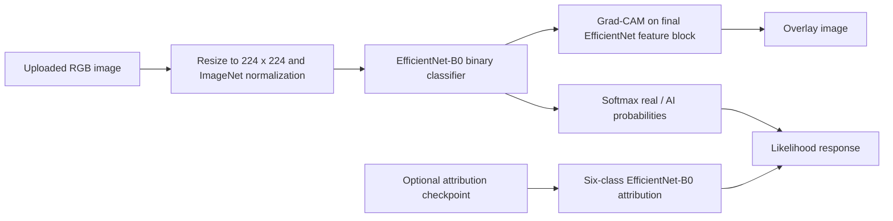

# SignalScope

SignalScope estimates whether a submitted image is likely real or AI-generated. It uses an EfficientNet-B0 binary classifier, returns softmax probabilities, and produces a Grad-CAM visualisation of the image regions that influenced the selected class. A separate six-class model supports experimental generator attribution when its checkpoint is supplied.

The result is an analytical likelihood, not proof of image origin, provenance, manipulation, or intent. SignalScope is not a face-swap/deepfake verifier and does not perform EXIF, C2PA, Content Credentials, image-text consistency, or adversarial analysis.

## Problem statement

Synthetic images can be used in misinformation, fraud, and misleading listings. A detector needs a useful real-versus-synthetic signal and honest uncertainty, especially on distributions that differ from training data. See [the problem statement](reports/Problem-Statement.md).

## Solution and current status



| Feature | Status | Evidence |
|---|---|---|
| Real vs AI-generated classification | Implemented | `src/models/model.py`, `app/backend.py` |
| Mixed-data training and held-out Defactify evaluation | Implemented, recorded experiment | `src/training/train_mixed.py`, `reports/mixed_results.md` |
| Grad-CAM overlay | Implemented | `src/explainability/gradcam.py`, `app/backend.py` |
| Generator attribution | Experimental; requires an external checkpoint | `src/attribution/`, `reports/attribution/` |
| JPEG, resize, blur, and brightness robustness evaluation | Implemented, recorded experiment | `src/robustness/training/test_pipeline.py`, `reports/robustness/robustness_results.csv` |
| React upload interface and local history | Implemented | `frontend/client/src/` |
| EXIF/C2PA/provenance verification | Planned / not implemented | No implementation found |
| Image-text consistency | Planned / not implemented | No implementation found |
| Active defence or adversarial testing | Planned / not implemented | No implementation found |
| Calibration or textual grounded explanations | Not implemented | Softmax scores and Grad-CAM only; no calibration/text module found |

## Technology stack

- Python, PyTorch, torchvision, scikit-learn, pandas, Pillow, OpenCV
- FastAPI backend with CORS restricted to local development origins
- React, TypeScript, Vite, Express static server frontend

## Repository layout

```text
app/backend.py                  FastAPI inference service
src/models/                     EfficientNet-B0 binary model and bundled baseline checkpoint
src/data/                       manifests, loaders, transforms, and Defactify helpers
src/training/                   CIFAKE and mixed-data training scripts
src/evaluation/                 CIFAKE, Defactify, and mixed-model evaluators
src/explainability/             Grad-CAM implementation and CLI
src/attribution/                experimental six-class attribution
src/robustness/training/        transformation robustness evaluator
frontend/                       Vite/React client and Express static server
reports/                        recorded experiment outputs and reports
docs/                           operational documentation
```

## Installation and local run

Prerequisites are Python 3.10+ and Node.js 20+ (the frontend metadata uses pnpm 10). From the repository root:

```powershell
python -m venv .venv
.\.venv\Scripts\Activate.ps1
python -m pip install --upgrade pip
python -m pip install -r requirements.txt
python -m uvicorn app.backend:app --reload --host 127.0.0.1 --port 8000
```

The tracked classifier checkpoint is `src/models/best_efficientnet_b0.pth`, the backend default. The API starts without the attribution checkpoint; attribution is omitted from responses. Start the frontend in a second terminal:

```powershell
Set-Location frontend
npm install
npm run dev
```

The frontend defaults to `http://127.0.0.1:8000`; set `VITE_API_URL` before building if the API uses another origin. Full details: [setup](docs/SETUP.md), [configuration](docs/CONFIGURATION.md), and [API](docs/API.md).

## Inference

Use the web UI or send multipart form data to the API:

```powershell
curl.exe -X POST http://127.0.0.1:8000/predict -F "file=@path\to\image.jpg"
```

Accepted types are JPEG, PNG, WebP, and BMP. The backend enforces a 15 MB upload limit. It returns a label, probabilities, a Grad-CAM overlay encoded as base64 PNG, and attribution only when its checkpoint is loaded.

For a local Grad-CAM image:

```powershell
python -m src.explainability.generate_heatmaps --image path\to\image.jpg --output reports\generated\overlay.jpg
```

## Training and evaluation

The datasets and mixed-model checkpoints are intentionally not tracked (`data/raw/`, `data/processed/`, `model/`, and `experiments/runs/` are ignored). Commands require the documented manifests and images:

```powershell
python -m src.training.train
python -m src.training.train_mixed
python -m src.evaluation.evaluate
python -m src.evaluation.evaluate_mixed
python -m src.robustness.training.test_pipeline
python -m src.attribution.evaluate_30k
```

These commands are not a single reproducible pipeline from a fresh clone because source datasets and most checkpoints are absent. See [model report](reports/model_report.md), [evaluation report](reports/evaluation_report.md), and [testing](docs/TESTING.md).

## Recorded results

The mixed-model Defactify evaluation contains 600 held-out images: 100 real and 100 each from Stable Diffusion 2.1, SDXL, Stable Diffusion 3, DALL-E 3, and Midjourney 6. At threshold 0.5, recorded metrics are ROC-AUC 0.8788, macro-F1 0.7303, accuracy 0.8200, FPR 0.2700, and FNR 0.1620. These are experiment artifacts, not final production claims.

The CIFAKE-only baseline records ROC-AUC 0.9973, macro-F1 0.9723, and accuracy 0.9723 on its CIFAKE test split; it is not directly comparable to the cross-generator Defactify score. Details and caveats are in [evaluation report](reports/evaluation_report.md).

## Frontend and demo

The interface supports upload, analysis, probability bars, Grad-CAM display, optional attribution display, and browser-local history (up to 12 entries). Insights and Robustness pages display values hard-coded from recorded reports, not live evaluation jobs. See [user guide](docs/USER_GUIDE.md) and [demo script](demo/demo_script.md).

## Limitations and future scope

Performance can vary by generator, domain, compression, resizing, and blur. Dataset and checkpoint provenance for a clean-room reproduction are incomplete. Grad-CAM is a model-attention aid, not a forensic finding. Generator attribution is experimental and does not establish provenance. See [limitations](reports/limitations.md).

Future work includes verified provenance/metadata checks, calibration, reproducible data acquisition, adversarial testing, image-text consistency, benchmark automation, and deployment hardening.

## References and originality

See [REFERENCES.md](REFERENCES.md) for datasets, pretrained components, libraries, and attribution. The project uses torchvision’s EfficientNet-B0 implementation and pretrained ImageNet weights when training scripts request them; SignalScope-specific training, evaluation, FastAPI integration, and frontend code are present in this repository.
